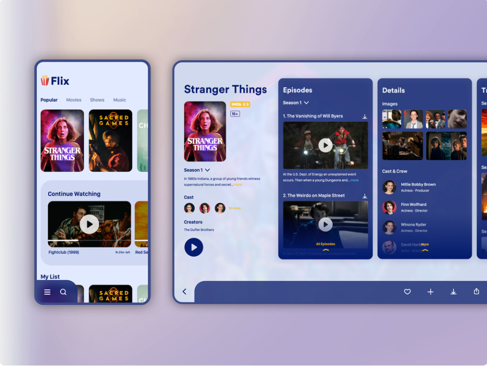
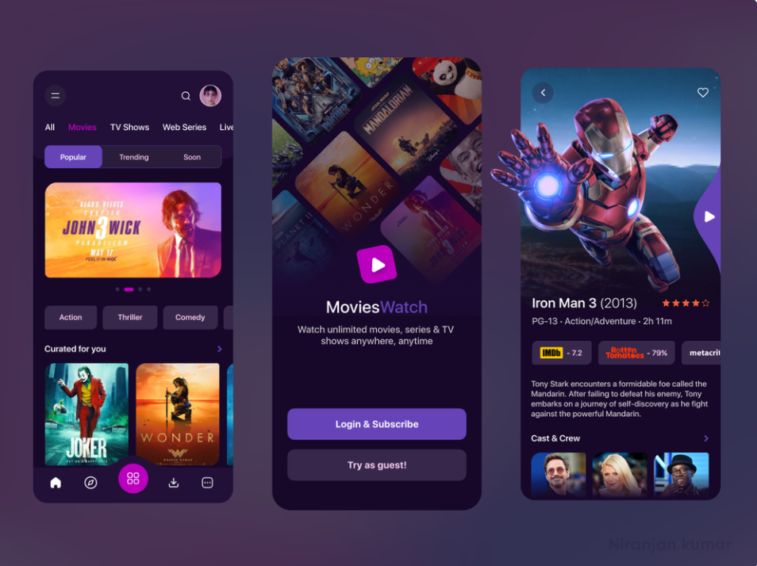
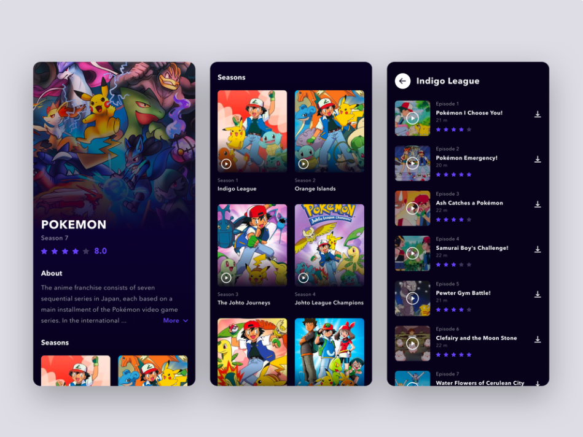
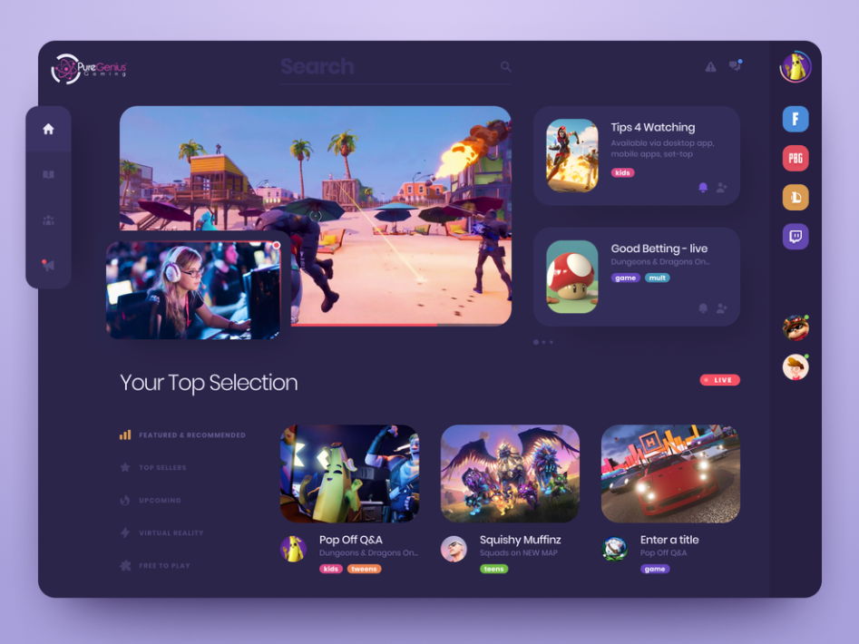
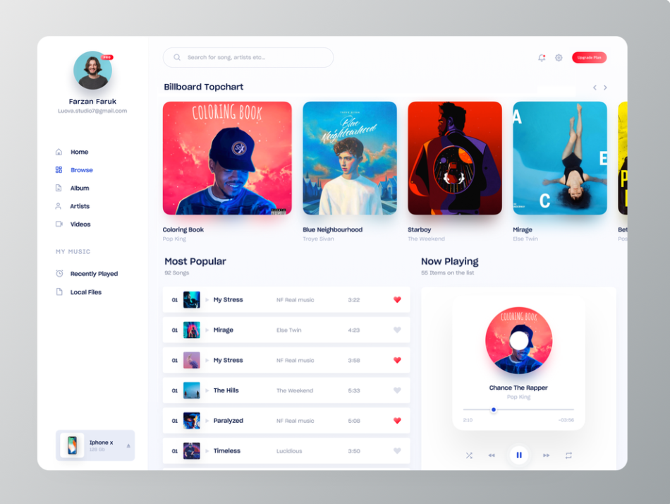
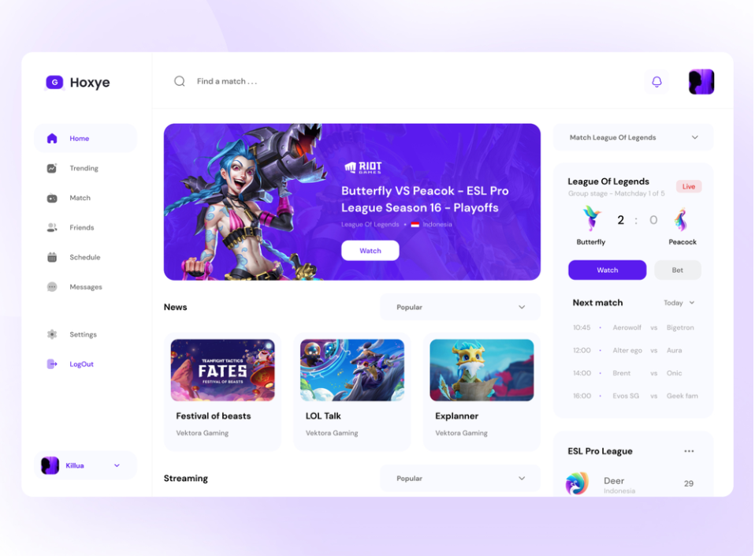

[TOC]

[넷플릭스 ux/ui 개선 오픈 프로젝트 ](https://blog.rightbrain.co.kr/?p=11426)

# 1. UX/UI idea

- 아코디언 메뉴 : 각 큐레이션에 아코디언 메뉴를 누르면 탭이 뜨면서 리스트 형태가 아닌 한눈에 볼 수 있는 기능
- 태그 강화(34p)

- 카테고리 수정 화면(36p)
- 10초 내외 비디오 친구에게 공유하기 기능(40p)

# 2. 메인페이지 카테고리 idea

1. 댓글 큐레이션

   : 유튜브 댓글함께보기처럼 / 영상을 볼 때 베스트댓글이 함께 나옴

   :thinking:뮤직비디오처럼 짧은 비디오에 잘어울릴것 같다.

   

2. 파워 DJ 채널

   인기 많은 DJ플레이리스트 노출처럼, 팔로워수가 많은 유저의 스트리밍리스트(또는 유저의 스트리밍리스트 자체에 좋아요 추가해서 그 리스트가 뜨게)가 카테고리에 노출

   

3. <u>(given 각각의 스트리밍 리스트에 좋아요 기능이 추가되었다는 가정)</u> 

   좋아요를 누른 타 유저의 스트리밍리스트 카테고리가 카테고리로 노출됨

   

4. 베스트 장면

   가장 많이 댓글이 많이 달린 장면이 캡쳐되서 노출 카테고리로 노출

   

5. 팔로워 가장 높은 인기 유저 랭킹 노출(즐겨찾기 메인)

   인기유저 프로필 누르면 -> 스트리밍 리스트 추가

# 3. Main Theme

1.

[source](https://dribbble.com/shots/7118134-TV-Show-Details)

2.

[source](https://dribbble.com/shots/14379133-MoviesWatch-On-Demand-Entertainment-App-Cinema-Tv-Series)

3.

[source](https://dribbble.com/shots/11340903-Pokemon-OTT-Platform)

4.

[source](https://dribbble.com/shots/13019545-Game-Dashboard)

5.

애플뮤직 포맷 / 기존 OTT + SNS가 합쳐진 형태니까 이런식으로 개인화 피드가 더 드러나는 UI는 어떨지? 

[source](https://dribbble.com/shots/7115996-Music-Player-Web-App-UI)

6.

[source](https://dribbble.com/shots/14775845--Hoxye)

